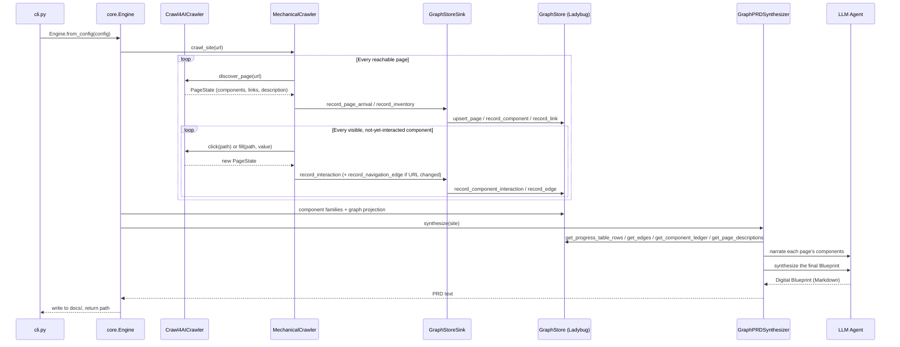

# Project Pragma: Architecture & Workflow

Pragma is an autonomous web-app "archaeology" tool. It mechanically crawls a site — following
every link and interacting with every discovered interactive element, no per-step AI decision
involved — writes what it finds live into a graph database, and then runs one post-hoc AI pass
over that graph to produce a Digital Blueprint (a Markdown PRD).

This is the crawl4ai-based architecture (migrated from an earlier, LLM-per-step-decision
Playwright loop — see `wiki/` for the durable lessons carried forward from that build, and
`wiki/crawl4ai-integration-pitfalls.md` for gotchas specific to this migration).

## Core Phases

1. **Crawl** (`MechanicalCrawler.crawl_site`): starting from the given URL, mechanically visit
   every reachable page and interact with every discovered interactive element on it — no LLM
   picks what to click. Live writes to `GraphStore` (`memory` by default; `ladybug` for a run whose
   data needs to persist and be queried after) as pages/components/edges are discovered and
   interacted with.
2. **Whole-site passes** (`Engine._run_async`): with the crawl finished writing, the store is
   wrapped in `CachingGraphStore` (`core/caching_graph_store.py`) and two passes run over the
   completed graph — `_apply_component_families` (cluster components into reusable patterns, then
   narrate each pattern's purpose) and `_apply_graph_projection` (`analysis/graph_projection.py`:
   modules, centrality, click depth, articulation points, written back onto `Page`).
3. **Documents** (`generators/pipeline.py`): every generator named in `PragmaConfig.documents` runs
   against that graph, then the master "Start Here" index. The Digital Blueprint
   (`GraphPRDSynthesizer`) is one of them, not the run's single output — see "Output Documents"
   below.

---

## Micro-kernel: Plugins & Registries

Pragma's kernel is `core/engine.py::Engine`. It wires exactly one crawling implementation
(`Crawl4AICrawler` + `MechanicalCrawler`, `spiders/`) directly — there's only one way to crawl
now, unlike agents/graph stores which are genuinely pluggable and still resolved via
`core/registry.py`:

- **`AGENT_REGISTRY`**: implementations of the `Agent` interface ("The Brain"/LLM backend) —
  `local`, `mock`. `Agent` is now just `generate(prompt, system_instruction)`
  — there is no more per-step decision schema for a backend to implement (see "What changed" below).
- **`GRAPH_STORE_REGISTRY`**: the storage backend — `ladybug` (on disk, one database per site) and
  `memory` (in-memory). Both names build the same `LadybugGraphStore`
  (`database/ladybug/store.py`), differing only in whether a directory is passed; they are kept as
  two names because that is what `pragma.yaml`, `cli.py --graph-store` and the wizard already
  answered to. Note there is no longer a `GraphStore` ABC to implement: `core/interfaces.py` is
  down to `Agent` plus re-exported data contracts, and the store is duck-typed against the methods
  its callers use. A second backend would mean reintroducing that interface first.

Each plugin module self-registers via a decorator (`@AGENT_REGISTRY.register("local")` on
`LocalAgent`, etc.). `core/bootstrap.py` imports every plugin module once so their
registrations run before the CLI resolves names from config.

Configuration (`core/config.py::PragmaConfig`) declares which agent/graph-store plugins to use
plus crawl-tuning settings (`max_pages`, `headless`, `fresh`). It merges, in
increasing precedence: built-in defaults, environment variables, an optional `config/pragma.yaml` file,
and explicit CLI flags.

---

## What changed from the LLM-per-step-decision loop

The earlier architecture (`SimplePRDGenerator`, the "Ralph-Loop") had an LLM pick one action
(navigate/click/fill/submit/finish) per iteration from a numbered list of discovered elements,
executed via a hand-rolled Playwright wrapper (`PlaywrightScraper`), with a final LLM call
synthesizing a PRD from an accumulated research log. That entire per-step decision loop is gone:

- **No more numbered-ref action vocabulary.** `Action`/`AgentAction`/`TOOL_SPECS`/
  `parse_agent_action`/`Agent.act()` (`core/interfaces.py`) are deleted — there's no
  structured action schema for a model to fill anymore. `LocalAgent`'s native-tool-calling
  fallback ladder went with them; `Agent` is `generate()` only.
- **No more `Scraper`/`PRDGenerator` ABCs.** They modeled a synchronous, lazily-started,
  single-`Page`/single-call-return shape that doesn't fit crawl4ai's async,
  `AsyncWebCrawler`-owns-the-browser-lifecycle model, or the new crawl-then-synthesize split.
- **`PlaywrightScraper`, the REST API server (`src/api_server/`), and `RestScraper` are deleted.**
  The REST server's `/dynamic/*` routes wrapped `PlaywrightScraper`'s per-action methods 1:1 for a
  model to call turn-by-turn — with no more per-step decisions, there's nothing left to wrap.
- **The discovery JS is preserved, not rewritten.** `PlaywrightScraper._discover_components`'s
  battle-tested selector-uniqueness/ARIA-role/shadow-DOM/accessible-label logic now lives in
  `spiders/content/js/discover_components.js`, run via `page.evaluate()` inside a crawl4ai hook
  (`Crawl4AICrawler`) instead of a Playwright `Page` method. One real bug was found and fixed in
  the port — see the plan/wiki for details.
- **`GraphStore` is the primary, live-updated source of truth**, not a secondary debug artifact
  (Neo4j held this role at the time of this migration, then DuckDB; Ladybug has held it since -
  see "Directory Roles" below). `research_logs/`, `progress_logs/`, and `graph_logs/` (the old per-run file-based
  logs) no longer exist — everything they used to capture (route status, the navigation graph, the
  component ledger, page descriptions) is written straight to `GraphStore` as the crawl happens
  (`GraphStoreSink`, `spiders/orchestration/graph_sink/sink.py`) and read back by the document
  generators.

---

## Discovery JS: unchanged battle-tested logic, new host

`spiders/content/js/discover_components.js` (plus `extract_links.js`/`extract_description.js`/
`extract_metadata.js`) is what `Crawl4AICrawler` (`spiders/browser/crawl4ai_crawler/crawler.py`) runs via
`page.evaluate()` inside crawl4ai hooks. Every historical fix documented in
`wiki/browser-automation-pitfalls.md` is preserved:

- Provably-unique CSS selectors (`CSS.escape`'d ids, `:nth-of-type` disambiguation for sibling
  elements with no id).
- Two-tier discovery: the full ARIA-role family (covers Radix/shadcn/MUI-style custom widgets) plus
  a `cursor: pointer` catch-all for markup with no semantic tag or role at all.
- Shadow-DOM piercing (`collectRoots` + `getRootNode().host` parent-walk) — including a fix, found
  during this migration's spike, for a shadow-root-direct-child losing its own path segment (see
  `discover_components.js`'s own comments for the concrete before/after).
- Accessible-label fallback chain (`aria-label` → `aria-labelledby` → `title` → `img[alt]` →
  `svg>title` → `textContent` last-resort), per-frame (iframe) discovery.

**Which crawl4ai hook runs discovery matters and is easy to get wrong** — see
`wiki/crawl4ai-integration-pitfalls.md` for two real bugs found here: `before_retrieve_html` is
correct for a plain-navigation discovery pass but fires *before* `js_code` runs, so re-discovery
after a scripted click must use `on_execution_ended` instead; and a navigating click's result URL
must be read from crawl4ai's `redirected_url` field, never `.url` (which is always the originally-
requested URL, unchanged regardless of what actually happened).

---

## Mechanical Interaction: Two Frontiers

`MechanicalCrawler` (`spiders/orchestration/mechanical_loop/loop.py`) replaces the old per-step decision loop
with two frontiers, composed but never conflated:

- **URL frontier**: a FIFO queue of discovered-but-not-visited pages, fed by every page's extracted
  links. No model decision needed — visited in deterministic discovery order.
- **Component/interaction frontier**: per page, every *visible*, not-yet-interacted-with component —
  no numeric cap; a page's interaction frontier is drained exhaustively, since this project prioritizes
  a complete graph over a bounded-worst-case runtime.

A click/fill that reveals new DOM on the *same* URL gets the newly-revealed components appended to
that pass's frontier. A click/fill that **navigates to a different URL**
stops that page's pass immediately — the session's live page has physically moved, so no further
frontier item from that pass can be safely acted on — and queues the destination URL onto the URL
frontier instead. The interrupted page gets re-queued for a follow-up pass rather than marked
done; convergence is guaranteed because every *attempted* component (success or failure) is marked
interacted, so a follow-up pass always makes real progress on whatever's left.

**Consult before acting, not just after**: `InteractionTracker` (in-memory by default, or
`GraphStoreInteractionTracker` when a `GraphStoreSink` is wired) is checked before mechanically
re-interacting with a component — this is what makes the crawl's "already touched this" property
survive across a persisted, multi-run crawl (`graph_store: ladybug`), not just within one process.

Fillable fields get their value from `fill_value_fn` — the deterministic
`fill_values.default_placeholder_fill_value` by default, or a real AI call
(`fill_value_agent.make_ai_fill_value_fn`) with its own dedicated system_instruction, run via
`asyncio.to_thread` so a slow local-model call never blocks the crawl's event loop, falling back to
the placeholder on any failure.

---

## Live Graph Store Wiring

`GraphStoreSink` (`spiders/orchestration/graph_sink/sink.py`) is the detail-rich writer `MechanicalCrawler` calls
directly as the crawl happens:

- `record_page_arrival` — the moment a page is reached (before discovery), plus its description.
- `record_inventory` — every discovered component (unconditional, regardless of interaction budget)
  plus every extracted link, plus structured facts for detected steppers/choice-groups
  (`component_classifier.py`, deterministic, no LLM).
- `record_interaction` — every *attempted* interaction (success or failure).
- `record_navigation_edge` — only when an interaction's resulting URL differs from the page it was
  attempted on.
- `record_page_finished` — only when a page's pass completes without being cut short by a
  navigation; an interrupted pass stays `Pending` for its guaranteed follow-up.

`utils/urls.py::clean_url()` is the one URL-canonicalization function every call site goes
through — scheme, trailing slash, and fragment stripped, so `https://x.com/y/#s` and
`http://x.com/y` collapse to the same graph-node key (`wiki/graph-based-crawl-tracking.md`'s "node
identity is the whole game").

`PragmaConfig.fresh` (default `false`) calls `GraphStore.reset()` in `Engine.from_config` before
crawling — matters for `graph_store: ladybug`, which persists across runs; a no-op for
`graph_store: memory`. The default flipped from `true` once resuming became possible: the pages a
cut-short run leaves `Pending` *are* the crawl's saved progress, and purging by default deleted them
before the next run could read them, so an interrupted crawl silently restarted from scratch every
time. This repo's own `pragma.yaml` sets `fresh: true` back on explicitly, paired with
`crawl_budget`, so each run re-purges and never gets past the first 20 pages — turn it off there to
walk a site in batches. `reset()` closes the connection, deletes the site's database directory and
reopens it, rather than issuing a `DELETE` per table in dependency order: a purging run reclaims the
disk instead of leaving freed-but-unshrunk pages behind.

---

## Graph Ontology: three tiers, and the names it is sometimes asked to have

The whole schema is one string - `database/ladybug/schema.py::DDL` - split into three tiers that
stay structurally separate because they carry different trust. Ladybug allows one label per node, so
a node's tier *is* its table; there is no marker label the way the retired Neo4j backend's
`:Inferred` was. Every table belongs to one crawled site by construction (one database per site), so
unlike the DuckDB schema this replaces, no table carries a `site` column and no key includes one.

**Observation - what the crawl saw.** `Site`, `Page`, `Component`, `Interaction`, `TextContent`,
`Container`, `Option`, `Request`, `Payload`.

**Inferred - deterministic clustering over observations.** `ComponentFamily`, `Endpoint`. An
`Endpoint` stores no aggregates of its own: status codes, schemas and auth schemes are computed on
read from the `Request` nodes that prove them, so there is nothing here that can go stale between
runs.

**Semantic - what the application means, not just what it renders.** `Screen`, `Entity`, `Field`,
`Flow`, `Rule`. **These five tables exist as DDL and nothing writes them yet** - the module their own
schema comment names (`semantic.py`) is not in the package. The tier is staged, not delivered.

Relationships, grouped by what they connect:

- **Page to page**: `LINKS_TO {label}` (a link found in the markup) and
  `NAVIGATES_TO {component, action, observation_count, first_seen_run, last_seen_run, created_at}`
  (a navigation an interaction actually caused). Kept apart on purpose: what the site claims you can
  reach and what the crawl proved you can reach are different facts.
- **Page to its contents**: `HAS_COMPONENT`, `HAS_TEXT`, `LOADED` (a request the page's own load
  fired, no component involved).
- **Structure**: `CONTAINS` (`Container` to `Component`, or to another `Container`) - direct
  containment only, one edge per consecutive ancestor pair. Full ancestry is a `CONTAINS*` traversal,
  not a stored closure; the retired DuckDB backend stored the whole transitive closure and it was
  that schema's largest table by far.
- **Interaction**: `PERFORMED` (`Component` to `Interaction`), `RESULTED_IN` (`Interaction` to the
  `Page` it left you on), `TRIGGERED` (`Interaction` to `Request`). An interaction is a node now,
  carrying `visit_id`/`step_seq`, which is what lets one control clicked twice keep each click's
  requests and outcome separate from the other's.
- **API**: `CALLS` (`Request` to `Endpoint`), `HAS_BODY {direction}` (`Request` to its
  content-addressed `Payload`).
- **Grouping**: `HAS_OPTION {seq}` (`Component` to `Option`), `VARIANT_OF` (`Component` to
  `ComponentFamily`).
- **Semantic tier, unwritten alongside its node tables**: `RENDERS`, `HAS_FIELD`, `EDITS`,
  `EXPOSES`, `STEP_OF {seq}`, `GOVERNS`, and `DERIVED_FROM {method, confidence, run_id, generator}` -
  one polymorphic edge table meant to carry every inferred/semantic node's trail back to the
  observations supporting it, since "what derived this, how, and how confidently" is the same
  question regardless of the node types on either end. **Declared, no writer.** Until something
  populates it, provenance is a schema commitment rather than a queryable property.

Two absences worth stating, since earlier versions of this document implied otherwise: there is no
`Site`-to-`Page` edge at all (a page is reachable through the tables, not through the `Site` row),
and the per-tag labels `:Button`/`:Input`/`:Link` are gone - they existed purely so Neo4j Browser
could color nodes apart, and nothing renders the graph visually now.

Reverse-engineering literature (and `research/plan-generacion-de-documentos.md`, which analyzes one
such proposal) commonly names these differently. **The mapping is what matters; the names stay as
they are.**

| Name found in the literature | This codebase | Note |
|---|---|---|
| `(:DOM_Element)` | `(:Component)` | Same thing: one discovered interactive element, keyed by `(page_url, path)` - `site` dropped out of the key when each site got its own database. |
| `(:UI_Component)` | `(:ComponentFamily)` | Partial. The family is the "atom" level; molecule/organism levels are deliberately out of scope. |
| `(:NetworkRequest)` | `(:Request)` + `(:Endpoint)` | Split in two: the observation (one HTTP call, body redacted and truncated) and the contract (one distinct method + path pattern). |
| `(:Page)` / `(:View)` | `(:Page)` | Unchanged. A semantic `(:Screen)` table now sits above it, unwritten. |
| `(:BusinessRule)` | `(:Rule)` | Table exists in the semantic tier with nothing writing it. Still frozen for the same reason as before: its value was almost entirely the human-in-the-loop review that is out of scope. |
| `[:TRIGGERS_EVENT]` | `[:PERFORMED]` + `[:TRIGGERED]` | The event type lives on the `Interaction` node, not the relationship name. |
| `[:CONTAINS]` / `[:COMPOSED_OF]` | `[:CONTAINS]` | Now present. Was absent when discovery recorded only interactive elements and text leaves; `discover_components.js` captures structural ancestry since. |
| `[:RESULTS_IN_STATE]` | `[:RESULTED_IN]` | Now present, and per interaction rather than per component - which is what fixed the "which request belongs to which move" ambiguity in `generators/user_flows.py`. |

---

### What the schema stages but nothing reads yet

Stated here rather than left for a reader to find by grepping, in the same spirit as the coverage
banner on every generated document:

- The **semantic tier** (five node tables, six edge tables, `DERIVED_FROM`) has no writer.
- **Graph projection results** - `module_id`, `module_label`, `click_depth`, `betweenness`,
  `pagerank`, `is_articulation_point` - are computed and written onto `Page` every run, but
  `analysis.py` exposes only `record_*` methods and no generator reads them back. No document
  currently shows a module, a depth or a bottleneck.
- The **retrieval surface** (`named_queries.py`'s query library, `raw_query.py`'s guarded Cypher
  escape hatch, `search.py`'s FTS indexes) has no caller in `generators/`. Document generators use
  ten whole-site read methods, the same set they used before the migration.

---

## Output Documents

Documents are plugins, resolved by name from `PragmaConfig.documents` through
`DOCUMENT_REGISTRY` — the same registry pattern as agents and graph stores. Each implements
`DocumentGenerator` (`core/documents.py`): declare `name`/`title`/`purpose`/`extension`,
implement `generate(request) -> str`, never touch the filesystem.

`generators/pipeline.py` runs them, prepends the crawl-coverage banner to every Markdown
document, writes each file, and closes with the master "Start Here" document — which indexes
whatever was produced and is the only generator that reads other generators' output rather than
the graph. A generator that raises is logged and skipped: one failed document must not cost a
twenty-minute crawl its other eight.

Adding a document is a new module in `generators/`, one `@DOCUMENT_REGISTRY.register(...)`
class, one import in `core/bootstrap.py`, and its name in config. `Engine` does not change.

---

## Post-hoc Synthesis

`GraphPRDSynthesizer` (`generators/graph_prd_synthesizer.py`) reads only from `GraphStore` —
`get_progress_table_rows`, `get_edges`, `get_component_ledger`, `get_page_descriptions` — and writes
nothing back. It runs independently of any live crawl: given a `site` whose graph was populated
hours or days ago, `synthesize()` needs nothing else.

Two-stage synthesis, each with its own dedicated `system_instruction`
(`wiki/prompt-engineering-for-llm-agents.md` Principle 1 — never shared across semantically
different calls, including with the fill-value call above):

1. One `agent.generate()` call per page (batched across all of that page's components, not one call
   per component), turning deterministic component facts into readable prose. A narration failure
   on one page degrades to that page's raw facts rather than aborting the whole catalog.
2. One final call assembling the page table, descriptions, narrated catalogs, and a rendered
   Mermaid navigation-graph flowchart into the final Digital Blueprint.

---

## Per-Provider Config Encapsulation

Each agent module owns a small `Config` dataclass colocated with its implementation, with a
`from_env()` classmethod that is the *only* place that reads that provider's env vars:

- `LocalConfig` (`agents/local_agent.py`): `LOCAL_API_URL`, `LOCAL_MODEL`.

Non-secret overrides come from `PragmaConfig.agents`, an optional nested `agents:` block in
`config/pragma.yaml` keyed by provider name (see `config/pragma.example.yaml`), letting settings (model name,
base URL) live in version-controllable config scoped per provider instead of more prefixed
globals in `.env`. Secrets (API keys, credential paths) stay in `.env` only.

`python3 cli.py config` (`core/wizard.py`) is the interactive front door to all of this: an
arrow-key menu (via `questionary`, with a plain-`input()` fallback when there's no TTY) walks
through agent/graph-store selection and that provider's `PROVIDER_FIELDS`, then writes non-secret
answers to `config/pragma.yaml` and secret answers to `.env` via `upsert_env_vars()` (`utils/io.py`).

Consequences: switching `--agent` never requires knowing another provider's variables, and adding a
new provider (e.g. Anthropic) is: write `anthropic_agent.py` with its own `Agent` subclass +
`AnthropicConfig.from_env()`, register a builder in `providers.py`, and add one import to
`core/bootstrap.py`. No other file changes.

---

## Directory Roles

- **`core/`**: The Kernel - `Engine`, plugin registries, the `Agent` interface, plain data
  contracts (`data_contracts.py`: `PageState`, `VisitStep`, `ComponentFacts`, `ComponentFamily`,
  `InferredRequest`, all re-exported from `interfaces.py`), the document contract (`documents.py`),
  the post-crawl read cache (`caching_graph_store.py`), and layered configuration
  (`PragmaConfig`).
- **`spiders/`**: The crawl itself — `Crawl4AICrawler` ("The Hands", crawl4ai-backed discovery
  + interaction), `MechanicalCrawler` (the two-frontier orchestration loop), `GraphStoreSink`/
  `GraphStoreInteractionTracker` (live graph-store wiring), `fill_value_agent.py`/`fill_values.py`
  (AI/placeholder fill values), plus the discovery JS assets in `js/`.
- **`agents/`**: LLM interface implementations ("The Brain") — `generate()` only.
- **`database/`**: the `ladybug/` package - one `LadybugGraphStore` assembled from eleven mixins
  over `schema.py::DDL`: `page.py`, `component.py`, `text_content.py`, `component_family.py`,
  `analysis.py`, `network.py`, `options.py`, `containment.py`, plus the retrieval surface split three
  ways (`raw_query.py`, `named_queries.py`, `search.py`). Every statement funnels through
  `writer.py`, which runs them all on one dedicated thread.
- **`analysis/`**: `graph_projection.py` - networkx over `get_edges()` for the analyses no storage
  engine here provides natively (module detection, centrality, click depth, cycles). Pure functions
  over plain data, with no storage dependency of its own.
- **`generators/`**: one module per output document (see "Output Documents"), the `pipeline.py`
  that runs them, and the pure helpers they share - `component_classifier.py` and
  `component_family.py` (deterministic classification and clustering, no LLM or browser
  dependency), `ledger.py`, `traces.py`, `coverage.py`.
- **`utils/`**: Basic I/O operations plus `urls.py::clean_url()`.
- **`docs/`**: Every generated document for every run, plus `index.md`/`runs.json` (the browsable
  run manifest) and `dev/` (the per-module developer notes every `Details:` docstring line points
  at). There are no `research_logs/`/`progress_logs/`/`graph_logs/` file-based debug logs: the graph
  store is the live, queryable record of a crawl. With `graph_store: ladybug` that record is a
  directory under `data/sites/<slug>.lbdb` - query it with Cypher through the `ladybug` package, or
  through this project's own `raw()`/`query()`/`search_text()` methods.
