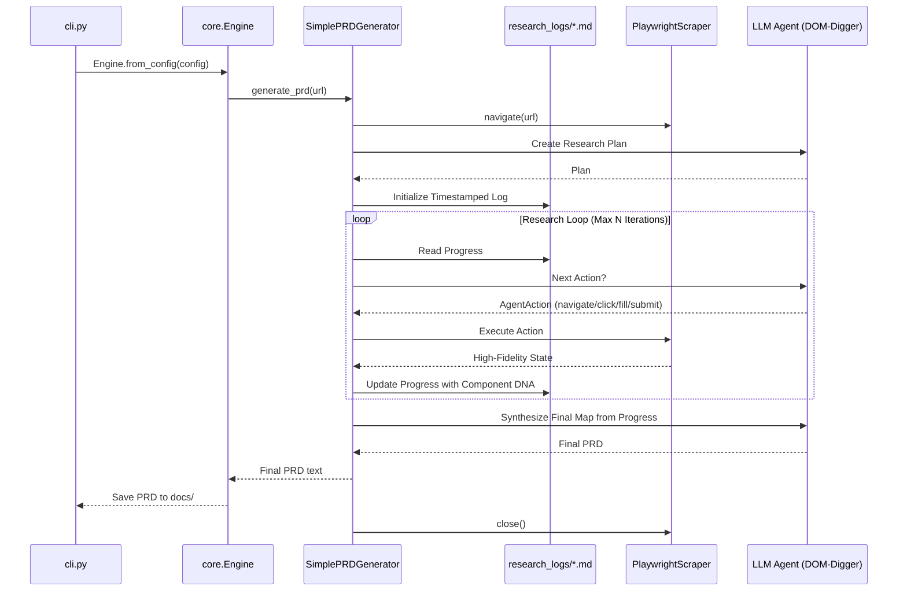

# Project Pragma: Architecture & Workflow

Pragma is an autonomous web-app archaeology tool. It follows a structured **Plan-Execute-Iterate** model (the "Ralph-Loop") to reverse-engineer complex frontend architectures.

## Core Phases

1.  **Phase 1: Discovery:** The agent navigates to the root URL to get an initial view of the layout and high-fidelity component DNA.
2.  **Phase 2: Planning:** The agent analyzes the initial discovery and generates an exhaustive research strategy.
3.  **Phase 3: Execution:** The agent enters an iterative loop where it:
    *   Reads the persistent research progress.
    *   Decides on deep-fidelity actions (`navigate`, `click`/`fill`/`submit <element number>`,
        `finish` - click/fill/submit refer to a numbered element from a short list shown that
        iteration, not a raw CSS path) via `Agent.act()`, which returns a structured `AgentAction`
        regardless of whether the backend used native tool-calling or the text-based fallback.
    *   Updates the timestamped research log with detailed component findings.
    *   Records a navigation-graph edge (which action led from which page to which page).
4.  **Phase 4: Synthesis:** The agent uses the entire research history to generate the final Digital Blueprint.

---

## The "Ralph-Loop" (Planned Autonomy)

---

## Micro-kernel: Plugins & Registries

Pragma's kernel is `src/core/engine.py::Engine`. It knows nothing about Playwright, Gemini, or
the specifics of the Ralph-Loop — it only knows how to resolve named plugins from three
registries (`src/core/registry.py`) and wire them together:

- **`SCRAPER_REGISTRY`**: implementations of the `Scraper` interface ("The Hands") — currently
  `playwright`.
- **`AGENT_REGISTRY`**: implementations of the `Agent` interface ("The Brain"/LLM backend) —
  currently `gemini`, `openai`, `local`, `mock`.
- **`GENERATOR_REGISTRY`**: implementations of the `PRDGenerator` interface (the orchestration
  strategy/loop) — currently `simple` (the Ralph-Loop described above).

Each plugin module self-registers via a decorator (`@SCRAPER_REGISTRY.register("playwright")` on
`PlaywrightScraper`, etc.). `src/core/bootstrap.py` imports every plugin module once so their
registrations run before the CLI resolves names from config. Adding a new scraper, agent, or
orchestration strategy never requires touching the Engine — only implementing the interface,
registering it, and adding one import line to `bootstrap.py`.

Configuration (`src/core/config.py::PragmaConfig`) declares *which* plugins to wire and basic
pipeline settings (output/log dirs, headless, iteration count). It merges, in increasing
precedence: built-in defaults, environment variables, an optional `pragma.yaml` file, and
explicit CLI flags — so a checked-in `pragma.yaml` can set project-wide defaults while any run
can override a single value from the command line.

The `Scraper` <-> `PRDGenerator` contract is a `PageState` dataclass (`url, title, metadata,
components, links`) rather than a raw dict, and the agent's navigate/click/fill/submit/finish
decisions are produced by `Agent.act()` as an `AgentAction` dataclass — both defined in
`src/core/interfaces.py`. `Agent.act()`'s default implementation calls `generate()` and parses the
reply as either a single JSON action object or the legacy `GOTO`/`CLICK`/`FINISH` text grammar
(`parse_agent_action()`, built on the older `parse_action()`); `LocalAgent` overrides `act()` to
attempt real OpenAI-style tool-calling first, falling back to the default when the server/model
doesn't support it (see `LocalAgent._act_native` in `src/agents/local_agent.py`). This means a new
scraper only needs to produce a `PageState`, and a new orchestration strategy only needs to consume
an `AgentAction`, without either side depending on the other's internal shape.

---

## Keeping Iteration Prompts Small: Indexed Element Refs

`_build_iteration_prompt` (`src/generators/prd_generator.py`) caps pending routes and DNA
components at `batch_size` items each - but item *count* isn't the only driver of prompt size.
Each DOM component's full CSS path (`body > header > ... > nav > ... > a`) and `attributes.class`
(often hundreds of characters on CSS-framework-heavy sites) used to be dumped verbatim as JSON for
every shown component, regardless of `batch_size`. On a page with a deep/complex nav, that alone
could dwarf the count-based cap and drive iteration/inference time up independent of `batch_size`.

DNA is now rendered as a short numbered list (`[1] <a> 'About'`, plus `type`/`placeholder`/`label`/
`disabled` when present so the model can tell a fill target from a click target and what it's
*for*) — never the full CSS path or class list. `label` (from an associated `<label for="...">`,
a wrapping `<label>`, or `aria-labelledby` — see `PlaywrightScraper._discover_components`) only
shows up when it adds information beyond `placeholder`/the element's own text, since a real form
field is often labelled but has no placeholder at all — without it, such a field looked
indistinguishable from an unlabelled one, leaving the model nothing to infer a sensible `fill`
value from (see the `text_field_values` `/static/*` topic for the fuller guidance on generating
one). A page-level `PageState.description` (meta description, or heading + first substantial
paragraph as a fallback — `PlaywrightScraper._extract_description`) is similarly surfaced as a
`Page context:` line each turn, and accumulated per-URL into a `## Page Descriptions` section
folded into the always-current `progress_file` (not the ephemeral per-call log — see
`_record_description`/`_build_descriptions_block`), so what a page/app is actually *about* reaches
the final PRD, not just its route/component structure. The model refers to a click/fill/submit
target by its number (`ref`);
`_resolve_ref_selector` maps that back to the real CSS path via `_dna_index_map`, which is rebuilt
fresh every iteration and never shown to the model. This is the single largest per-iteration
prompt-size reduction available, on top of `batch_size`, `wait_seconds`, and provider `timeout` for
taming slow/small local models. Unlike the old text protocol, an unresolvable ref is *not* silently
treated as a literal CSS path or text match - it fails with a clear error that gets surfaced back
into the next iteration's prompt (see "Error feedback loop" below), since letting the model invent
a selector on its own was a bigger source of confused failures than a clear rejection is.

**Which `batch_size` components get shown is not just "the first N in DOM order"** -
`_select_dna_components` sorts by (currently visible, never shown before) ahead of raw DOM
position. Regression fix: a real-site crawl (austral.edu.ar) got permanently stuck re-clicking a
mega-menu trigger (`ref 8`) every iteration - its own submenu items were present in the DOM from
page load (just CSS-hidden, `PlaywrightScraper._discover_components`'s `visible` field) but sat at
DOM position ~273 on a 323-component page, so a pure `state.components[:batch_size]` slice never
once surfaced them no matter how many times the trigger was clicked. `_shown_component_paths`
tracks every path ever offered to the model (never reset mid-run) so an already-shown element also
yields its slot to one that's never been offered, once both are visible.

## Error Feedback Loop

A failed action's error message is stashed in `_last_action_error` when `_execute_action` catches
it, and `_last_error_line()` surfaces it once into the *next* iteration's prompt (`"Note: your last
action (...) failed: ..."`), then clears it. Previously this error was only ever printed/logged -
never shown to the model - so a bad click or navigation choice got no feedback and was often
repeated blindly on the next iteration.

**`finish` is the one action the engine actively rejects rather than just informs about.**
`_execute_loop`'s docstring is explicit that the engine otherwise never overrides the model's
choices - but a real crawl (empanad.app, a single-page app whose `Pending routes` list is *always*
empty) clicked a submit button with only one of two fields filled, changing the page from 3 to 11
components while staying on the exact same URL, and concluded research on the very next turn
without looking at any of them. An *informational* nudge alone (the `structure_line`/`change_line`
hints below) wasn't enough for a small local model to actually act on, and `finish` is terminal -
unlike a bad click, there's no later turn to recover the missed exploration in - so
`_reject_premature_finish` blocks it once when `_build_iteration_prompt`'s last call revealed
components never shown before (`_last_new_component_count`, captured *at prompt-build time* - by
the time the model's response comes back, `_shown_component_paths` already includes everything
just shown, so recomputing the check then would always find zero "new" ones). The block converges:
once those components have actually been shown in a subsequent prompt, a repeat `finish` proceeds
normally.

## Component Ledger

`_component_ledger` (`src/generators/prd_generator.py`) is a per-page, per-component record - keyed
by cleaned page URL, then by CSS path - of every component ever shown, whether it's been interacted
with, and the ordered list of actions actually taken on it (`{action, value, resulting_url}` per
interaction). It answers a question neither of the other two persisted artifacts do: the navigation
graph (`graph_log_file`) only records edges that *changed* page state, not every attempted
interaction, and never says what *wasn't* touched; the progress log is an append-only narrative, not
a structured per-component index.

Two consumers of the same data: `_write_component_ledger` writes the whole thing as JSON once the
run finishes (`components_log_file`, same folder as `graph_log_file` - one more config dimension for
one more debug file wasn't worth it), for a human to inspect after the fact; and
`_describe_dna_element` renders an inline `(interacted)` marker on every Clickable-elements line
where `_component_ledger` says a ref has been acted on before - the same "have I already done this"
signal `current value=` already gives for a text field's own content, but generalized to every
component kind (a clicked button carries no visible state of its own the way a filled input does, so
without this a clicked button looked identical on the next turn to one never touched).

Populated at two points: `_record_component_seen` (called from `_build_iteration_prompt`, for every
currently-shown component - creates the entry on first sight, `interacted: false`) and
`_record_component_interaction` (called from `_handle_iteration_result`, only for click/fill/submit
actions whose ref resolved to a real path - appends an interaction and flips `interacted` to `true`).
`navigate`/`finish`/`help` never target a specific component, so they never touch this.

---

## Navigation Graph

Route status (pending/visited) doesn't capture *how* the crawl got from one page to another. Each
successful navigate/click/fill/submit is recorded as a `{from, action, to}` edge in `self.graph_edges`
(`_handle_iteration_result`), written at the end of the run as JSON to `graph_log_file` and
rendered as a Mermaid flowchart appended to `progress_log_file` (`_write_graph_log`,
`_build_mermaid_graph`) — so the exploration path is visible both to tooling (JSON) and to a human
glancing at the debug trail (auto-rendered diagram in GitHub/VS Code markdown preview).

`graph_store: neo4j` persists across runs, scoped per site (`site` property, see `GraphStore`'s
docstring) - by design, so a large crawl can resume progress across sessions. But a site whose
URLs are per-session tokens (e.g. a `/o/<random-id>` order flow - no two crawls of it will ever
share a URL) turns that persistence into pure accumulation: every past run's pages stay "visited"
forever, none of which will ever be seen again, while still being read back as real history by the
next run's plan/synthesis steps (a real crawl of `empanad.app` reached "13/13 visited, 0 pending"
on a *fresh* session token before doing anything). `PragmaConfig.fresh` (default `true`) calls
`GraphStore.clear_site(site)` in `Engine.from_config` before wiring the generator, purging exactly
that site's prior nodes/edges/links - `--no-fresh` opts back into cross-run persistence for a
genuinely resumable multi-session crawl of a large, stable site. `InMemoryGraphStore.clear_site` is
a no-op in effect (nothing survives past one process anyway), implemented anyway so callers stay
backend-agnostic.

---

## Per-Provider Config Encapsulation

As more AI providers get added, their env vars, credentials, and model settings must not pile
up into one flat, ever-growing `.env`. Each agent module owns a small `Config` dataclass
colocated with its implementation, with a `from_env()` classmethod that is the *only* place that
reads that provider's env vars:

- `GeminiConfig` (`src/agents/gemini_agent.py`): `GEMINI_API_KEY`, `GEMINI_MODEL`.
- `GeminiOAuthConfig` (`src/agents/gemini_oauth_agent.py`): `GOOGLE_APPLICATION_CREDENTIALS`,
  `GEMINI_MODEL`.
- `OpenAIConfig` (`src/agents/openai_agent.py`): `OPENAI_API_KEY`, `OPENAI_MODEL`.
- `LocalConfig` (`src/agents/local_agent.py`): `LOCAL_API_URL`, `LOCAL_MODEL`.

`src/agents/providers.py` (the `gemini`/`openai` registry builders) only decides *which* class to
instantiate and applies optional overrides on top of each `Config.from_env()` — it never reads a
provider's env vars itself. Those overrides come from `PragmaConfig.agents`, an optional nested
`agents:` block in `pragma.yaml` keyed by provider name (see `pragma.example.yaml`), letting
non-secret settings (model name, base URL) live in version-controllable config scoped per
provider instead of more prefixed globals in `.env`. Secrets (API keys, credential paths) stay in
`.env` only.

`python3 src/cli.py config` (`src/core/wizard.py`) is the interactive front door to all of this:
an arrow-key menu (via `questionary`, with a plain-`input()` fallback when there's no TTY) walks
through scraper/agent/generator selection and that provider's `PROVIDER_FIELDS`, then writes
non-secret answers to `pragma.yaml` and secret answers to `.env` via `upsert_env_vars()`
(`src/utils/io.py`), which patches just the changed keys in place. Existing values are shown as
editable defaults, so re-running the wizard to tweak one setting never clobbers the rest.

Consequences: switching `--agent` never requires knowing another provider's variables, and
adding a new provider (e.g. Anthropic) is: write `anthropic_agent.py` with its own `Agent`
subclass + `AnthropicConfig.from_env()`, register a builder in `providers.py` (or decorate the
class directly if it needs no OAuth-vs-REST branching), and add one import to
`src/core/bootstrap.py`. No other file changes.

---

## Module 3: Unified REST API (execution + knowledge)

`scraper: rest` (`src/scrapers/rest_scraper.py`) is an alternate `Scraper` backend that executes
actions through a standing local REST service (`src/api_server/`) instead of driving
`PlaywrightScraper` in-process. Thinking of the system as three modules — Module 1: the remote
LM Studio/model server (Tailscale-tunneled, portable to any OpenAI-compatible API — see
`LocalConfig` below); Module 2: this orchestrator; Module 3: this local API server — the browser
session's lifetime is decoupled from any one orchestrator run, and a small curated-docs layer is
folded in alongside it.

**Key mechanic worth restating**: the model never calls any endpoint directly — it has no network
access, only a chat-completions HTTP response. It picks a short verb from `TOOL_SPECS`
(`src/core/interfaces.py`), and the *orchestrator* parses that choice and makes the actual HTTP
call to Module 3. This is why swapping transports (this module previously used MCP; now plain
REST) never touches the model-facing contract at all.

One process, three path-prefixed namespaces:

- **`/dynamic/*`** (`src/api_server/dynamic.py`) — `navigate`/`click`/`fill`/`submit`/`get_state`,
  each wrapping the matching `PlaywrightScraper` method 1:1. A persistent `PlaywrightScraper`
  singleton lives for the server process's whole lifetime, on one dedicated worker thread
  (Playwright's sync API can't run inside a thread with an active asyncio event loop, which
  FastAPI/uvicorn has — the same constraint the removed MCP server worked around the same way).
  `SimplePRDGenerator` still resolves `ref -> selector` itself (`_dna_index_map`) before calling
  any `/dynamic/*` route — the server only ever receives an already-resolved CSS selector.
- **`/static/*`** (`src/api_server/static_docs.py`) — a small, hand-curated, exact-match set of
  named topics (`click_usage`, `fill_submit_flow`, `ref_semantics`, `navigate_usage`,
  `finish_criteria`, `goal_overview`) the model can pull via a `help` verb in `TOOL_SPECS` when the
  terse one-line action descriptions aren't enough. No embeddings/vector search — per
  `wiki/local-and-small-model-constraints.md`, the real cost for a small model is prompt tokens,
  not lack of retrieval sophistication, so this stays a closed vocabulary the same way the action
  verbs already are. `SimplePRDGenerator` injects the fetched text into the *next* turn's prompt
  only (ephemeral), and `help` calls don't count against a run's `max_iterations` budget since they
  don't change page state.
- **`/components/*`** (`src/api_server/components.py`) — read-only access to the persisted
  component checklist (`GraphStore`'s Component nodes: `interacted` state plus each element's
  viewport-relative bounding box at discovery time). Unlike `/dynamic/*`, this reads state written
  by a *different* process (a `SimplePRDGenerator` CLI run) via `graph_store: neo4j`, a shared
  database — `graph_store: memory` never persists cross-process, so these routes return a 503
  rather than a misleading empty result in that case. `GET /components/state?site=..&page_url=..`
  returns `{path: {tag, text, interacted, visible, x, y, width, height}}`; `GET
  /components/debt?site=..` returns the same revisit-queue `_reject_premature_finish` enforces.

**Important:** none of this fixes a local model's flaky native tool-calling support (`LocalAgent`'s
three-tier degrade — see "Keeping Iteration Prompts Small" above) — that's a model/chat-template
limitation, orthogonal to which protocol executes the resulting action. This module is an
architecture/lifecycle improvement plus a token-cost-conscious way to give the model deeper
guidance on demand, not a claimed fix for tool-calling reliability itself.

**Lifecycle**: unlike the transient-subprocess model MCP used, Module 3 is meant to be started once
(`python -m src.api_server`) and left running, conceptually parallel to Module 1 always running on
the remote PC — `RestScraper` is just an HTTP client pointed at it (`PRAGMA_API_URL`, default
`http://127.0.0.1:8765`). Consequences: the browser session now persists across multiple
orchestrator runs (no relaunch cost during iterative development); `headless`/`wait_seconds` are
Module 3's own startup env vars, not threaded per-run from `pragma.yaml`; and `RestScraper.close()`
is deliberately a no-op — an orchestrator run ending should not kill the shared browser session.

Manual debugging: `curl http://127.0.0.1:8765/static/topics` or
`curl -X POST http://127.0.0.1:8765/dynamic/navigate -d '{"url": "..."}'` let you exercise either
namespace directly, independent of the LLM loop — useful for isolating "is this a schema/docs
problem or a model problem."

---

## Directory Roles

- **`src/core/`**: The Kernel — `Engine`, plugin registries, shared interfaces/contracts
  (`PageState`, `Action`), and layered configuration (`PragmaConfig`).
- **`src/scrapers/`**: High-fidelity stateful Playwright session manager ("The Hands").
- **`src/api_server/`**: Module 3 — unified REST API (execution + curated docs) behind a
  persistent, addressable process — see "Module 3: Unified REST API" above.
- **`src/agents/`**: LLM interface with Persona/Skill support ("The Brain").
- **`src/generators/`**: Manages the Plan-Execute-Iterate loop and persistent memory.
- **`src/utils/`**: Basic I/O operations.
- **`docs/`**: Final generated Digital Blueprint PRDs.
- **`research_logs/`**: Live status snapshot (route table) for the current session, overwritten on
  every update. This is the file `_synthesize_tree_report` reads back in to build the final PRD.
- **`progress_logs/`**: Append-only debug trail, one entry per DISCOVERY/PLAN/ITERATION/SYNTHESIS
  stage, in order, for the entire run. Never overwritten, never read back by the engine itself -
  purely for a human to inspect what the agent actually said/did, e.g. to spot a malformed
  response or a bad prompt. Location configurable via `progress_logs_dir` in `pragma.yaml` or
  `--progress-logs`. Gets a rendered Mermaid flowchart of the navigation graph appended once the
  run finishes.
- **`graph_logs/`**: The navigation graph as JSON - a list of `{from, action, to}` edges, one per
  successful navigate/click/fill/submit, recording which action led from which page to which page.
  Configurable via `graph_logs_dir` / `--graph-logs`.

---

## Persistent Memory & Debugging

Pragma keeps two separate logs per session, serving different purposes:

- **`research_logs/{slug}_research_{ts}.md`**: the engine's *working memory*. `_update_progress()`
  rewrites this file on every stage with the current route table and the latest log entry only -
  it's a snapshot, not a history. This is what gets fed back into the agent for the final
  synthesis step (`_synthesize_tree_report`), so it only needs to reflect current state.
- **`progress_logs/{slug}_progress_{ts}.md`**: the *audit trail*. Every DISCOVERY/PLAN
  CREATED/ITERATION N/SYNTHESIS stage is appended here in full, including the agent's raw
  response text even when it was malformed or failed to produce an action. This is the file to
  open when debugging why a run stalled, an iteration produced no progress, or a model's output
  didn't match the expected action format (a JSON action object, or the legacy
  `GOTO`/`CLICK`/`FINISH` text grammar as fallback).
