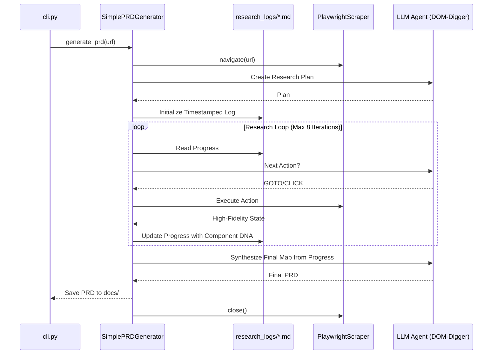

# Project Pragma: Architecture & Workflow

Pragma is an autonomous web-app archaeology tool. It follows a structured **Plan-Execute-Iterate** model (the "Ralph-Loop") to reverse-engineer complex frontend architectures.

## Core Phases

1.  **Phase 1: Discovery:** The agent navigates to the root URL to get an initial view of the layout and high-fidelity component DNA.
2.  **Phase 2: Planning:** The agent analyzes the initial discovery and generates an exhaustive research strategy.
3.  **Phase 3: Execution:** The agent enters an iterative loop where it:
    *   Reads the persistent research progress.
    *   Decides on deep-fidelity actions (`GOTO`, `CLICK` via text or CSS path).
    *   Updates the timestamped research log with detailed component findings.
4.  **Phase 4: Synthesis:** The agent uses the entire research history to generate the final Digital Blueprint.

---

## The "Ralph-Loop" (Planned Autonomy)

---

## Directory Roles

- **`src/scrapers/`**: High-fidelity stateful Playwright session manager ("The Hands").
- **`src/agents/`**: LLM interface with Persona/Skill support ("The Brain").
- **`src/generators/`**: Manages the Plan-Execute-Iterate loop and persistent memory.
- **`src/utils/`**: Basic I/O operations.
- **`docs/`**: Final generated Digital Blueprint PRDs.
- **`research_logs/`**: Detailed, timestamped history of the agent's exploration and decisions.

---

## Persistent Memory & Documentation

Pragma maintains a detailed log in **`research_logs/`** for every session. This file captures:
*   The agent's initial research plan.
*   Every iteration's observations, including **Component DNA** (paths, roles, visibility).
*   Every action taken (`GOTO`, `CLICK`) and its outcome.

This ensures that the final PRD is a synthesis of the entire archaeological journey, and the logs provide a permanent audit trail of the agent's discovery process.
