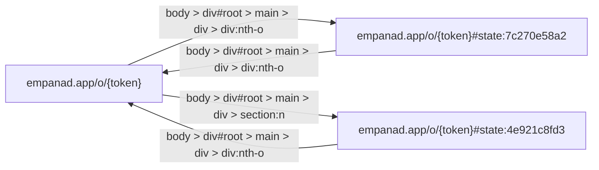

**Digital Blueprint for empanad.app**

### Overview
Empanad.app is a web application designed to facilitate group ordering of empanadas. Users can create a link, share it with their friends, and each person can add their desired flavors to the order. The app automatically calculates and displays the total cost.

### Navigation Structure

#### Main Flow
1. **Initial Page (`empanad.app/o/{token}`)**
   - **Description**: This is the primary page where users interact with the ordering process.
   - **Components**:
     - **EmpanadApp Logo/Link**: A brand logo or link that can be used to return to the main page or different sections.
     - **Input Field (Number)**: An input field for entering a number, likely used for numeric values such as quantities or specific details.
     - **Combobox (searchable dropdown)** "Otra / No sé": A searchable dropdown menu for selecting an option from the menu.
     - **Text Field**: A general text input field that might be used for various purposes.
     - **Buttons**:
       - **Agregar variedad** (x2): Buttons to add more varieties of empanadas to the order.
       - **Finalizar mi pedido**: Initiates the finalization process of the order.
       - **Agregar / Restar** (x14): Buttons to increase or decrease the quantity of each item in the order.
     - **Stepper Controls** "Sumar" (x13): Stepper controls to increment/decrement quantities.
     - **Buttons for Sharing and Adding Details**:
       - **Copiar link**: Allows the user to copy a URL.
       - **Invitar por WhatsApp**: Initiates an interaction to invite someone via WhatsApp.
       - **Detalle por persona**: Adds details for each person in the party.
       - **Agregar pedido de alguien más**: Option to add another order for someone else.

2. **Order Details Page (`empanad.app/o/{token}#state:4e921c8fd3`)** 
   - **Description**: This page shows detailed information about the current order.
   - **Components**:
     - Similar to the initial page but with a focus on displaying the current state of the order.

### Navigation Graph
The navigation graph is represented below, showing the interaction paths within the application:

### Usage Flow
1. **User opens the application and navigates to `empanad.app/o/{token}`**:
   - They see the initial page with options for adding empanadas, sharing the link, and managing the order.

2. **Adding Items**:
   - Users can add different varieties of empanadas using the "Agregar variedad" buttons.
   - They can adjust quantities by clicking on the "Agregar / Restar" or using the stepper controls.

3. **Sharing Order**:
   - Users can copy a link to share with their friends.
   - They can also invite someone via WhatsApp by pressing the "Invitar por WhatsApp" button.

4. **Finalizing the Order**:
   - When ready, users click on the "Finalizar mi pedido" button to complete and lock in their order.

5. **Detailed Information**:
   - Users can view detailed information about each person associated with the current order by pressing the "Detalle por persona" button.
   - They can add another order for someone else using the "Agregar pedido de alguien más" button.

### Conclusion
Empanad.app provides a streamlined and interactive platform for group empanada ordering. The application is designed to be user-friendly, allowing users to easily share their orders and manage them in real-time.