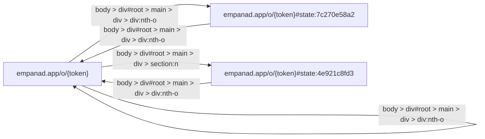

_(overview synthesis unavailable: Response truncated: the model hit max_tokens before finishing (finish_reason: 'length'). This is almost always max_tokens set too low for a reasoning model's chain-of-thought - raise agents.local.max_tokens (or LOCAL_MAX_TOKENS) in pragma.yaml/.env and try again, or unset it entirely to let the model use as much as it needs.)_

## Section 1

_(section summary unavailable: Response truncated: the model hit max_tokens before finishing (finish_reason: 'length'). This is almost always max_tokens set too low for a reasoning model's chain-of-thought - raise agents.local.max_tokens (or LOCAL_MAX_TOKENS) in pragma.yaml/.env and try again, or unset it entirely to let the model use as much as it needs.)_

- empanad.app/o/{token} [Finished, 11 components]
  Description: Organizá el pedido de empanadas con tus amigos en segundos. Compartí un link, cada uno suma sus sabores y vos ves el total automáticamente.
  Components:
_(narration unavailable: Response truncated: the model hit max_tokens before finishing (finish_reason: 'length'). This is almost always max_tokens set too low for a reasoning model's chain-of-thought - raise agents.local.max_tokens (or LOCAL_MAX_TOKENS) in pragma.yaml/.env and try again, or unset it entirely to let the model use as much as it needs.)_

Raw facts:
```
1. type='button' text='(no accessible label found on this element)' interacted=False
2. type='link' text='EmpanadApp' interacted=True
3. type='button' text='Copiar link' interacted=True
4. type='button' text='Invitar por WhatsApp' interacted=True
5. type='submit button' text='Crear pedido' interacted=True
6. type='combobox (searchable dropdown)' text='Otra / No sé' interacted=True
7. type='text field (text)' text='(no accessible label found on this element)' interacted=True
8. type='button' text='Agregar variedad' interacted=True
9. type='button' text='Agregar variedad' interacted=False
10. type='button' text='Finalizar mi pedido' interacted=True
11. type='button' text='Agregar' interacted=True
12. type='button' text='Restar' interacted=True
13. type='stepper control (increment/decrement)' text='Sumar' interacted=True current_value=None
14. type='button' text='Agregar' interacted=True
15. type='button' text='Restar' interacted=True
16. type='stepper control (increment/decrement)' text='Sumar' interacted=True current_value=None
17. type='button' text='Agregar' interacted=True
18. type='button' text='Restar' interacted=True
19. type='stepper control (increment/decrement)' text='Sumar' interacted=True current_value=None
20. type='button' text='Agregar' interacted=True
21. type='button' text='Restar' interacted=True
22. type='stepper control (increment/decrement)' text='Sumar' interacted=True current_value=None
23. type='button' text='Detalle por persona' interacted=True
24. type='button' text='Agregar pedido de alguien más' interacted=True
25. type='text field (number)' text='(no accessible label found on this element)' interacted=True
26. type='list/menu option' text='Mi Gusto' interacted=False
27. type='list/menu option' text='Solo Empanadas' interacted=False
28. type='list/menu option' text='1810 Cocina Regional' interacted=False
29. type='list/menu option' text='La Continental' interacted=False
30. type='list/menu option' text='El Noble' interacted=False
31. type='list/menu option' text='El Hornero' interacted=False
32. type='list/menu option' text='Morita' interacted=False
33. type='list/menu option' text='La Leñita' interacted=False
34. type='list/menu option' text='El Sanjuanino' interacted=False
35. type='list/menu option' text='La Morada' interacted=False
36. type='list/menu option' text='La Cocina' interacted=False
37. type='list/menu option' text='El Gauchito' interacted=False
38. type='list/menu option' text='Cumaná' interacted=False
39. type='list/menu option' text='La Paceña' interacted=False
40. type='list/menu option' text='Las Cabras' interacted=False
41. type='list/menu option' text='El Santa Evita' interacted=False
42. type='list/menu option' text='Roma del Abasto' interacted=False
43. type='list/menu option' text='Empanadas Tremendas' interacted=False
44. type='list/menu option' text='El Cuartito' interacted=False
45. type='list/menu option' text='Maná Empanadas' interacted=False
46. type='list/menu option' text='Tercera Docena' interacted=False
47. type='list/menu option' text='Otra / No sé' interacted=False
48. type='list/menu option' text='Calabaza' interacted=False
49. type='list/menu option' text='Atún' interacted=False
50. type='list/menu option' text='Bondiola' interacted=False
51. type='list/menu option' text='Cordero' interacted=False
52. type='list/menu option' text='Carne dulce' interacted=False
53. type='list/menu option' text='Hamburguesa con cheddar' interacted=False
54. type='list/menu option' text='Salchicha con cheddar' interacted=False
55. type='list/menu option' text='Cerdo a la barbacoa' interacted=False
56. type='list/menu option' text='Dulce de leche' interacted=False
57. type='list/menu option' text='Manzana' interacted=False
58. type='list/menu option' text='Carne con aceituna' interacted=False
59. type='list/menu option' text='Carne catamarqueña' interacted=False
60. type='list/menu option' text='Lomito y cheddar' interacted=False
61. type='list/menu option' text='Lomo picante' interacted=False
62. type='list/menu option' text='Osobuco' interacted=False
63. type='list/menu option' text='Mondongo' interacted=False
64. type='list/menu option' text='Mollejas al verdeo' interacted=False
65. type='list/menu option' text='Matambrito al verdeo' interacted=False
66. type='list/menu option' text='Cantimpalo y queso' interacted=False
67. type='list/menu option' text='Jamón y roquefort' interacted=False
68. type='list/menu option' text='Jamón, queso y cebolla' interacted=False
69. type='list/menu option' text='Cebolla caramelizada y queso' interacted=False
70. type='list/menu option' text='Provolone' interacted=False
71. type='list/menu option' text='Fugazzeta' interacted=False
72. type='list/menu option' text='Albahaca' interacted=False
73. type='list/menu option' text='Panceta y queso' interacted=False
74. type='list/menu option' text='Choclo y queso' interacted=False
75. type='list/menu option' text='Espinaca y queso' interacted=False
76. type='list/menu option' text='Acelga y salsa blanca' interacted=False
77. type='list/menu option' text='Pollo picante' interacted=False
78. type='list/menu option' text='Pollo y salsa blanca' interacted=False
79. type='list/menu option' text='Pollo a la leña' interacted=False
80. type='list/menu option' text='Pollo y cheddar' interacted=False
81. type='list/menu option' text='Queso y verdeo' interacted=False
82. type='list/menu option' text='Queso y hongos' interacted=False
83. type='list/menu option' text='Hongos' interacted=False
84. type='list/menu option' text='Berenjena ahumada y provoleta' interacted=False
85. type='list/menu option' text='Tomate, albahaca y muzzarella' interacted=False
86. type='list/menu option' text='Pascualina' interacted=False
87. type='list/menu option' text='Brócoli y champignon' interacted=False
88. type='list/menu option' text='Calabaza y choclo' interacted=False
89. type='list/menu option' text='Calabaza y queso' interacted=False
90. type='list/menu option' text='Criolla dulce' interacted=False
91. type='list/menu option' text='Peras y roquefort' interacted=False
92. type='list/menu option' text='Roquefort y cebolla' interacted=False
93. type='list/menu option' text='Roquefort y queso' interacted=False
94. type='list/menu option' text='Roquefort, apio y nuez' interacted=False
95. type='list/menu option' text='Vacío cheddar' interacted=False
96. type='list/menu option' text='Carne picante' interacted=False
97. type='list/menu option' text='Lomo' interacted=False
98. type='list/menu option' text='Carne cortada a cuchillo' interacted=False
99. type='list/menu option' text='Salteña' interacted=False
100. type='list/menu option' text='Tucumana' interacted=False
101. type='list/menu option' text='Jamón, queso y huevo' interacted=False
102. type='list/menu option' text='Matambre a la pizza' interacted=False
103. type='list/menu option' text='Vacío y provoleta' interacted=False
104. type='list/menu option' text='Jamón crudo y rúcula' interacted=False
105. type='list/menu option' text='Cebolla y queso' interacted=False
106. type='list/menu option' text='Napolitana' interacted=False
107. type='list/menu option' text='Humita' interacted=False
108. type='list/menu option' text='Choclo' interacted=False
109. type='list/menu option' text='Espinaca' interacted=False
110. type='list/menu option' text='Acelga y muzzarella' interacted=False
111. type='list/menu option' text='Roquefort' interacted=False
112. type='list/menu option' text='Champignon y queso' interacted=False
113. type='list/menu option' text='Cuatro quesos' interacted=False
114. type='list/menu option' text='Panceta y ciruela' interacted=False
115. type='list/menu option' text='Pollo al verdeo' interacted=False
116. type='list/menu option' text='Pollo al champignon' interacted=False
117. type='list/menu option' text='Queso y albahaca' interacted=False
118. type='list/menu option' text='Caprese' interacted=False
119. type='combobox (searchable dropdown)' text='(no accessible label found on this element)' interacted=False
120. type='combobox (searchable dropdown)' text='(no accessible label found on this element)' interacted=False
```
- empanad.app [Pending, 0 components]
- empanad.app/o/{token}#state:4e921c8fd3 [Pending, 0 components]
  Description: Organizá el pedido de empanadas con tus amigos en segundos. Compartí un link, cada uno suma sus sabores y vos ves el total automáticamente.
  Components:
### Action Buttons and Navigation

*   **Close Button:** Closes the current view or modal.
*   **Cancelar Button:** Cancels the current operation or action.
*   **Crear Button:** Submits the form or creates a new item/order.
*   **EmpanadApp Link:** Navigates to the EmpanadApp website (currently interacted with).
*   **Copiar link Button:** Copies the current link.
*   **Invitar por WhatsApp Button:** Initiates sharing the link via WhatsApp.

### Order Modification and Quantity Controls

This section manages the quantity or details of the order:

*   **Restar Button:** Decreases a quantity or value. (Appears multiple times)
*   **Sumar Stepper Control:** Increases a quantity or value. (Appears multiple times, currently showing no selected value)
*   **Detalle por persona Button:** Opens an interface to view details per person.
*   **Agregar pedido de alguien más Button:** Allows adding an order from another person.

### Item Selection and Input Fields

*   **Agregar variedad Button:** Adds a specific variety or item.
*   **Text Field:** A general text input field for entry (no explicit label is provided).
*   **Number Text Field:** A numerical input field for entering a quantity (no explicit label is provided).
- empanad.app/o/{token}#state:7c270e58a2 [Pending, 0 components]
  Description: Organizá el pedido de empanadas con tus amigos en segundos. Compartí un link, cada uno suma sus sabores y vos ves el total automáticamente.
  Components:
### Navigation

*   **EmpanadApp Link:** Navigates to the main EmpanadApp page.

### Actions and Modifiers

*   **Copy Link Button:** Copies the current link.
*   **Invite via WhatsApp Button:** Initiates an invitation process via WhatsApp.
*   **Add Variety Button:** Allows the user to add a new variety item.
*   **Add Button (x4):** Used for adding items or requests.
*   **View Details by Person Button:** Opens an interface to view details based on a specific person.
*   **Add Order for Someone Else Button:** Allows the user to add an order on behalf of another person.

### Input

*   **Number Field:** A field intended for numerical input (no specific label is provided).

## Navigation Graph


