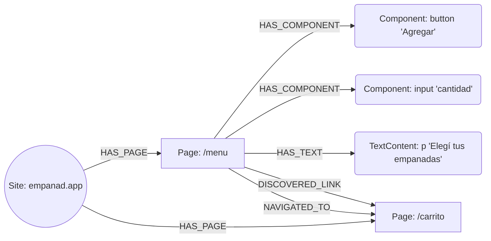

# Cómo Neo4j guarda el grafo de Pragma

> ⚠️ **Sección de identidad de URL desactualizada** (migración a `crawl4ai`, commit `f5f1c02`) — ver
> el aviso al final de este doc. El esquema de nodos/relaciones de abajo (`Site`/`Page`/`Component`/
> `TextContent`) sí está al día (actualizado para
> [`docs/explicativos/plan-almacenamiento.md`](plan-almacenamiento.md) Fase A) contra
> [`src/core/interfaces.py::GraphStore`](../../src/core/interfaces.py) — pero como con cualquier doc
> explicativo, ante una duda puntual el código de la interfaz manda.

> Código de referencia: [`src/storage/neo4j_graph_store.py`](../../src/storage/neo4j_graph_store.py),
> [`src/storage/memory_graph_store.py`](../../src/storage/memory_graph_store.py) (la misma
> interfaz sin base de datos externa), y la interfaz `GraphStore` en
> [`src/core/interfaces.py`](../../src/core/interfaces.py).

Neo4j es opcional (`graph_store: memory` es el default y no persiste entre procesos) pero es el
backend recomendado para cualquier corrida que quieras poder inspeccionar después, compartir
entre procesos (ej. el servidor REST leyendo lo que escribió una corrida de CLI), o retomar entre
sesiones.

## Los cuatro tipos de nodo

| Label | Qué representa | Propiedades |
|---|---|---|
| `Site` | Un dominio crawleado. Uno solo por sitio. | `name` |
| `Page` | Una URL ya normalizada dentro de ese sitio. | `site`, `url`, `status` (`Pending`/`Finished`), `components` (cantidad), `context`, `label`, `description` (resumen corto — meta description o encabezado + primer párrafo, ver `PageState.description`), `title` (el `<title>` real de la página — distinto de `label`, que es el texto del link que llevó hasta acá), `visited_at` |
| `Component` | Un elemento interactivo encontrado en una `Page` puntual: botón, link, input, opción de un combo, etc. | `site`, `page_url`, `path`, `tag`, `text`, `role`, `input_type`, `visible`, `layer` (`semantic`/`pointer` — el catch-all `cursor: pointer` de última instancia), `x`, `y`, `width`, `height` (bounding box en el momento del descubrimiento), `component_type` (clasificación determinística, ver `component_classifier.py`), `options` (JSON de steppers/grupos de choice/opciones reveladas), `interacted`, `interactions` (lista JSON de `{action, value, resulting_url}`), `network_requests` (lista JSON de tandas de requests xhr/fetch "significativos" que disparó cada interacción — ver `src/crawlers/network_filter.py`) |
| `TextContent` | Un bloque de texto no interactivo (`<p>`/`<h1-6>`/`<li>`/...) de una `Page` — separado de `Component` a propósito, ver el comentario en `src/core/interfaces.py::GraphStore.record_text_content`. | `site`, `page_url`, `path`, `tag`, `text`, `visible`, `x`, `y`, `width`, `height` |

## Las relaciones

| Tipo | De → a | Qué significa | Se crea/actualiza en |
|---|---|---|---|
| `HAS_PAGE` | `Site → Page` | "Esta página pertenece a este sitio." | `upsert_page` |
| `HAS_COMPONENT` | `Page → Component` | "Este elemento vive en esta página." | `record_component`, `record_component_interaction`, `record_component_options`, `record_component_network` |
| `HAS_TEXT` | `Page → TextContent` | "Este bloque de texto vive en esta página." | `record_text_content` |
| `DISCOVERED_LINK` | `Page → Page` | "Se vio un link hacia esta otra página" — aunque el crawler nunca lo haya seguido. | `record_link` |
| `NAVIGATED_TO` | `Page → Page` | "El crawler realmente se movió de A a B", con qué componente/acción lo hizo. | `record_edge` |



## Identidad: cómo se evita duplicar

Al conectar (`connect()`), se crean dos constraints de unicidad:

- `page_site_url`: `(Page.site, Page.url)` es único.
- `component_identity`: `(Component.site, Component.page_url, Component.path)` es único.
- `text_content_identity`: `(TextContent.site, TextContent.page_url, TextContent.path)` es único.

Todo alta/actualización usa `MERGE` sobre esa clave (nunca `CREATE` a secas para `Page`/
`Component`/`TextContent`), así que visitar la misma URL dos veces actualiza el mismo nodo en vez de
crear uno nuevo. `NAVIGATED_TO` es la excepción: se crea con `CREATE`, no `MERGE`, porque cada
navegación real es un evento distinto que vale la pena guardar aunque el par origen/destino se
repita.

## Los `<id>` / `<elementId>` que aparecen en Neo4j Browser

Esos dos campos **no los pone Pragma**. Neo4j los genera automáticamente para cualquier nodo o
relación que exista en la base, sin importar el label o las propiedades — son el mecanismo
interno de la base para ubicar el registro físico, sin significado de negocio.

| Campo | Quién lo genera | Qué podés asumir |
|---|---|---|
| `<elementId>` | Neo4j (motor), automático | Un handle interno único del registro (ej. `4:05a0b43e-...:837`). Cambia si migrás/exportás la base. Ningún archivo de Pragma lo lee ni lo escribe. |
| `<id>` | Neo4j (motor), formato legado | Igual que arriba, numérico, oficialmente deprecado en favor de `elementId`. |
| `site + url` (`Page`) | Pragma, vía la constraint `page_site_url` | Esta es la identidad real que el código usa para decidir "¿es la misma página que ya vi?" |
| `site + page_url + path` (`Component`) | Pragma, vía `component_identity` | Igual, para un elemento dentro de una página puntual. |

## `fresh` y persistencia entre corridas

`graph_store: neo4j` persiste entre procesos, a propósito — así una crawl grande puede retomarse
entre sesiones. `PragmaConfig.fresh` (default `true`) llama a `GraphStore.clear_site(site)` antes
de arrancar cada corrida, purgando los `Page`/`Component`/relaciones previos de ese sitio.
`--no-fresh` desactiva esto para una crawl multi-sesión genuina de un sitio grande y estable.
`InMemoryGraphStore.clear_site` es un no-op en la práctica (nada sobrevive a un proceso de todos
modos), implementado igual para que quien llama no necesite saber qué backend está activo.

**Por qué esto importa**: sin `fresh`, un sitio cuyas URLs incluyen un token por sesión (ver
"Problema conocido" abajo) acumula para siempre — cada corrida deja páginas "Finished" que nunca
se van a volver a ver, y la próxima corrida las lee como historia real al armar el plan/síntesis.
Una crawl real de `empanad.app` llegó a "13/13 visitadas, 0 pendientes" en un token de sesión
recién creado, antes de hacer nada — puro efecto de acumulación entre corridas.

## Identidad de URL con tokens dinámicos (automático desde la migración a `crawl4ai`)

La constraint de unicidad funciona perfecto — nunca vas a tener dos `Page` con exactamente el
mismo `(site, url)`. El problema es **qué string llega a `url` antes de compararse**, y esto ya no
lo resuelve config por sitio en `pragma.yaml` (`dynamic_url_segments`, como describía una versión
vieja de este documento) — lo resuelve automáticamente
[`src/utils/urls.py`](../../src/utils/urls.py), con dos funciones para dos preguntas distintas:

- **`clean_url(url)`**: identidad *física* — saca esquema, `www.`, barra final y fragmento
  (`https://www.example.com/x/#s` y `http://example.com/x` → `example.com/x`). Es la que decide "el
  browser realmente navegó a otro lado" (`MechanicalCrawler._visit_page`) — nunca se colapsa más
  que esto para esa pregunta puntual.
- **`route_shape(url)`**: un paso más allá de `clean_url()` — colapsa cualquier segmento del path
  que *parezca* un token opaco generado (largo, alfanumérico mixto — `_TOKEN_SEGMENT_RE` +
  `_looks_generated`, nunca el dominio) a un placeholder `{token}` compartido. Es lo que
  `GraphStoreSink` usa como `page_key` real para escribir en `GraphStore` (`upsert_page`,
  `record_component`, etc.) — así que **la clave que termina en Neo4j como `Page.url` para un sitio
  de tokens de sesión ya es la versión colapsada**, no la URL literal con el hash.

| URL real vista durante el crawl | `clean_url()` (identidad física) | `route_shape()` (identidad de storage / `Page.url`) |
|---|---|---|
| `empanad.app/o/elk5kvp8trn54Kx2bNOlw0c3GjVCAGhhP` | `empanad.app/o/elk5kvp8trn54Kx2bNOlw0c3GjVCAGhhP` | `empanad.app/o/{token}` |
| `empanad.app/o/9zQwT2xrLk0pAvBnMcYh1sDf3eKu` | `empanad.app/o/9zQwT2xrLk0pAvBnMcYh1sDf3eKu` | `empanad.app/o/{token}` |

Las tres instancias de la tabla anterior de este doc ya colapsan solas a un único nodo `Page`
(`empanad.app/o/{token}`) sin configurar nada — la heurística es automática, no opt-in como en la
arquitectura anterior. La contrapartida deliberadamente aceptada: es una heurística (`_looks_generated`
exige mezcla de mayúsculas/dígitos, un slug real como `admisiones` nunca matchea), así que un ID de
producto real con esa misma forma (ej. un ASIN) también colapsaría — ver el propio docstring de
`route_shape()` para el razonamiento completo de por qué ese trade-off se acepta.

Dos consecuencias directas para quien lea el grafo en Neo4j Browser:

- **`Page.url` para un sitio de tokens de sesión nunca es una URL navegable literal** — es la
  plantilla con `{token}`. Esto es intencional (ver el punto anterior), no un dato corrompido.
- `route_shape()` **nunca** se usa para decidir si el browser navegó de verdad (eso sigue siendo
  siempre `clean_url()`) — mezclar las dos identidades ahí reintroduciría el bug que motivó
  separarlas (ver `wiki/graph-based-crawl-tracking.md`, "Two identities, two different questions").

Sigue sin resolverse (ver `docs/explicativos/pendientes-futuras-fases.md`): la normalización no se
aplica dentro de una ruta de hash-SPA conservada (`#/products/123`), y el propio `wiki/graph-based-
crawl-tracking.md` documenta un tercer caso de identidad — un cambio de pantalla SPA en la misma
URL — que tampoco captura ninguna de las dos funciones de este archivo (ver su sección "A same-URL
DOM change can be a full screen replacement").

## Consultar el grafo manualmente

Neo4j Browser (`http://localhost:7687` vía bolt, UI normalmente en `http://localhost:7474`, según
como esté levantado el `docker-compose.yml` del proyecto) acepta Cypher directo. Algunas útiles:

```cypher
// Todas las páginas de un sitio, con cuántos componentes tiene cada una
MATCH (p:Page {site: "empanad.app"}) RETURN p.url, p.status, p.components ORDER BY p.components DESC

// Componentes nunca interactuados de una página puntual (el mismo chequeo que usa _reject_premature_finish)
MATCH (c:Component {site: "empanad.app", page_url: "empanad.app/menu", interacted: false}) RETURN c.tag, c.text, c.path

// El camino real que siguió el crawl
MATCH (a:Page {site: "empanad.app"})-[r:NAVIGATED_TO]->(b:Page) RETURN a.url, r.component, b.url ORDER BY r.created_at
```
