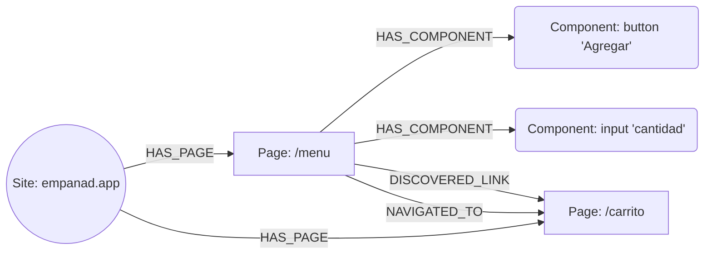

# Cómo Neo4j guarda el grafo de Pragma

> ⚠️ **Parcialmente desactualizado** (migración a `crawl4ai`, commit `f5f1c02`). Los nodos `Page`/
> `Component` y sus relaciones siguen existiendo tal como se describe abajo, pero `GraphStore`
> sumó campos y un nodo nuevo que este doc no cubre todavía: `description`/`title` en `Page`,
> `network_requests` en `Component`, y un nodo de texto estático separado (`record_text_content`/
> `get_text_content_ledger`). La identidad de URL (sección final de este doc) ahora la resuelve
> `src/utils/urls.py::clean_url()`/`route_shape()` — automático, sin necesitar configurar
> `dynamic_url_segments` a mano como se describía acá. Revisar
> [`src/core/interfaces.py::GraphStore`](../../src/core/interfaces.py) antes de confiar en el
> detalle exacto de campos.

> Código de referencia: [`src/storage/neo4j_graph_store.py`](../../src/storage/neo4j_graph_store.py),
> [`src/storage/memory_graph_store.py`](../../src/storage/memory_graph_store.py) (la misma
> interfaz sin base de datos externa), y la interfaz `GraphStore` en
> [`src/core/interfaces.py`](../../src/core/interfaces.py).

Neo4j es opcional (`graph_store: memory` es el default y no persiste entre procesos) pero es el
backend recomendado para cualquier corrida que quieras poder inspeccionar después, compartir
entre procesos (ej. el servidor REST leyendo lo que escribió una corrida de CLI), o retomar entre
sesiones.

## Los tres tipos de nodo

| Label | Qué representa | Propiedades |
|---|---|---|
| `Site` | Un dominio crawleado. Uno solo por sitio. | `name` |
| `Page` | Una URL ya normalizada dentro de ese sitio. | `site`, `url`, `status` (`Pending`/`Finished`), `components` (cantidad), `context`, `label`, `visited_at` |
| `Component` | Un elemento interactivo encontrado en una `Page` puntual: botón, link, input, opción de un combo, etc. | `site`, `page_url`, `path`, `tag`, `text`, `role`, `input_type`, `visible`, `layer` (`semantic`/`pointer`, ver [`playwright.md`](playwright.md)), `x`, `y`, `width`, `height`, `component_type`, `options`, `interacted`, `interactions` (lista JSON de `{action, value, resulting_url}`) |

## Las relaciones

| Tipo | De → a | Qué significa | Se crea/actualiza en |
|---|---|---|---|
| `HAS_PAGE` | `Site → Page` | "Esta página pertenece a este sitio." | `upsert_page` |
| `HAS_COMPONENT` | `Page → Component` | "Este elemento vive en esta página." | `record_component`, `record_component_interaction`, `record_component_options` |
| `DISCOVERED_LINK` | `Page → Page` | "Se vio un link hacia esta otra página" — aunque el agente nunca lo haya seguido. | `record_link` |
| `NAVIGATED_TO` | `Page → Page` | "El agente realmente se movió de A a B", con qué componente/acción lo hizo. | `record_edge` |



## Identidad: cómo se evita duplicar

Al conectar (`connect()`), se crean dos constraints de unicidad:

- `page_site_url`: `(Page.site, Page.url)` es único.
- `component_identity`: `(Component.site, Component.page_url, Component.path)` es único.

Todo alta/actualización usa `MERGE` sobre esa clave (nunca `CREATE` a secas para `Page`/
`Component`), así que visitar la misma URL dos veces actualiza el mismo nodo en vez de crear uno
nuevo. `NAVIGATED_TO` es la excepción: se crea con `CREATE`, no `MERGE`, porque cada navegación
real es un evento distinto que vale la pena guardar aunque el par origen/destino se repita.

## Los `<id>` / `<elementId>` que aparecen en Neo4j Browser

Esos dos campos **no los pone Pragma**. Neo4j los genera automáticamente para cualquier nodo o
relación que exista en la base, sin importar el label o las propiedades — son el mecanismo
interno de la base para ubicar el registro físico, sin significado de negocio.

| Campo | Quién lo genera | Qué podés asumir |
|---|---|---|
| `<elementId>` | Neo4j (motor), automático | Un handle interno único del registro (ej. `4:05a0b43e-...:837`). Cambia si migrás/exportás la base. Ningún archivo de Pragma lo lee ni lo escribe. |
| `<id>` | Neo4j (motor), formato legado | Igual que arriba, numérico, oficialmente deprecado en favor de `elementId`. |
| `site + url` (`Page`) | Pragma, vía la constraint `page_site_url` | Esta es la identidad real que el código usa para decidir "¿es la misma página que ya vi?" |
| `site + page_url + path` (`Component`) | Pragma, vía `component_identity` | Igual, para un elemento dentro de una página puntual. |

## `fresh` y persistencia entre corridas

`graph_store: neo4j` persiste entre procesos, a propósito — así una crawl grande puede retomarse
entre sesiones. `PragmaConfig.fresh` (default `true`) llama a `GraphStore.clear_site(site)` antes
de arrancar cada corrida, purgando los `Page`/`Component`/relaciones previos de ese sitio.
`--no-fresh` desactiva esto para una crawl multi-sesión genuina de un sitio grande y estable.
`InMemoryGraphStore.clear_site` es un no-op en la práctica (nada sobrevive a un proceso de todos
modos), implementado igual para que quien llama no necesite saber qué backend está activo.

**Por qué esto importa**: sin `fresh`, un sitio cuyas URLs incluyen un token por sesión (ver
"Problema conocido" abajo) acumula para siempre — cada corrida deja páginas "Finished" que nunca
se van a volver a ver, y la próxima corrida las lee como historia real al armar el plan/síntesis.
Una crawl real de `empanad.app` llegó a "13/13 visitadas, 0 pendientes" en un token de sesión
recién creado, antes de hacer nada — puro efecto de acumulación entre corridas.

## Identidad de URL con tokens dinámicos (con arreglo opt-in disponible)

> **Actualización**: esto ya tiene arreglo, pero es **opt-in por sitio** — no
> corregido automáticamente. Si no configurás nada, el comportamiento sigue
> siendo exactamente el descripto abajo.

La constraint de unicidad funciona perfecto — nunca vas a tener dos `Page` con exactamente el
mismo `(site, url)`. El problema es **qué string llega a `url` antes de compararse**. La
normalización de URL (`_clean_url` en `SimplePRDGenerator`) hoy:

- Saca el esquema (`https://`), la barra final, y fragmentos que no parecen una ruta de SPA.
- **No toca query strings.**
- **No reconoce segmentos dinámicos del path** — un token de sesión/orden/carrito incrustado
  directamente en la ruta (ej. `/o/elk5kvp8trn54Kx2bNOlw0c3GjVCAGhhP`) no se distingue de una ruta
  real.

Resultado: cada visita con un token distinto mina un `Page` nuevo (y su propio set de
`Component`, porque la identidad de `Component` incluye `page_url`), aunque sea exactamente la
misma pantalla lógica.

| URL real vista durante el crawl | ¿Misma página para un humano? | ¿Misma `Page` hoy? |
|---|---|---|
| `empanad.app/o/elk5kvp8trn54Kx2bNOlw0c3GjVCAGhhP` | Sí — las tres son "resumen de orden" | No — 3 nodos `Page` distintos |
| `empanad.app/o/9zQwT2xrLk0pAvBnMcYh1sDf3eKu` | | |
| `empanad.app/o/aB7cD9eFgH2iJkL4mNoP6qRsT8uV` | | |

Esto **no es un bug de Neo4j ni de la constraint** — están haciendo exactamente lo que se les
pide. El arreglo consiste en decidir, antes de que el string llegue a la constraint, qué partes de
una URL son "ruta" y cuáles son "dato variable de esa visita puntual".

**Cómo se resuelve hoy** (`SimplePRDGenerator._clean_url`, `_normalize_dynamic_segments`,
`_normalize_query`): declarás por sitio, en `pragma.yaml`, qué segmentos del path son dinámicos:

```yaml
dynamic_url_segments:
  - '^[A-Za-z0-9]{16,}$'
strip_query_params: true   # default - descarta query strings salvo los listados en keep_query_params
```

Cada segmento del path (nunca el dominio) se compara con `re.fullmatch` contra cada patrón — si
matchea, se reemplaza por el placeholder literal `{id}` antes de construir la clave del nodo. Las
tres URLs de la tabla de arriba colapsan a un solo `Page`: `empanad.app/o/{id}`.

Deliberadamente **no** es una heurística automática ("esto parece un token") — es opt-in por
sitio, para no fusionar por error un ID de producto real (ej. un código tipo ASIN) que también sea
alfanumérico largo. Como la clave con placeholder no es una URL real navegable, `_clean_url` guarda
la primera URL concreta vista para cada plantilla (`_template_sample_urls`), y `_resolve_goto_url`
la usa si el agente elige esa ruta desde la lista de Pending — nunca intenta cargar el string
`.../o/{id}` literal.

Sigue sin resolverse (ver `docs/explicativos/pendientes-futuras-fases.md`): la normalización no se
aplica dentro de una ruta de hash-SPA conservada (`#/products/123`).

## Consultar el grafo manualmente

Neo4j Browser (`http://localhost:7687` vía bolt, UI normalmente en `http://localhost:7474`, según
como esté levantado el `docker-compose.yml` del proyecto) acepta Cypher directo. Algunas útiles:

```cypher
// Todas las páginas de un sitio, con cuántos componentes tiene cada una
MATCH (p:Page {site: "empanad.app"}) RETURN p.url, p.status, p.components ORDER BY p.components DESC

// Componentes nunca interactuados de una página puntual (el mismo chequeo que usa _reject_premature_finish)
MATCH (c:Component {site: "empanad.app", page_url: "empanad.app/menu", interacted: false}) RETURN c.tag, c.text, c.path

// El camino real que siguió el crawl
MATCH (a:Page {site: "empanad.app"})-[r:NAVIGATED_TO]->(b:Page) RETURN a.url, r.component, b.url ORDER BY r.created_at
```
