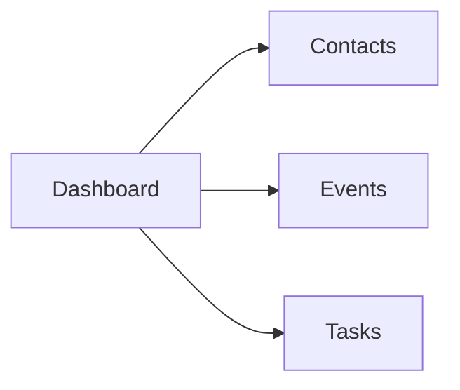

# Digital Blueprint for Web Application

## Overview
The web application appears to be a simple personal information management tool designed to help users keep track of their contacts, events, and tasks. It seems to be structured around a main dashboard with links to different sections for managing various aspects of the user's life.

## Navigation Graph

### Dashboard
**Route:** `/`
- **Description:** The starting page that provides an overview of all the main sections of the application. It may include a quick summary or list of recent activities.
- **Components:**
  - Links to "Contacts", "Events", and "Tasks" sections.

### Contacts
**Route:** `/contacts`
- **Description:** A section where users can view, add, edit, and delete their contacts.
- **Components:**
  - List of all contacts with options to view details or edit each contact.
  - Form to add new contacts.

### Events
**Route:** `/events`
- **Description:** A section where users can view, add, edit, and delete their scheduled events.
- **Components:**
  - List of all events with options to view details or edit each event.
  - Form to add new events.

### Tasks
**Route:** `/tasks`
- **Description:** A section where users can view, add, edit, and delete their tasks or to-dos.
- **Components:**
  - List of all tasks with options to view details or edit each task.
  - Form to add new tasks.

## User Flow
1. **Home Page (Dashboard):** The user starts at the dashboard page, where they can see quick overviews and links to manage their contacts, events, and tasks.
2. **Navigating Sections:** From the dashboard, users can click on any of the three sections: "Contacts", "Events", or "Tasks".
3. **Managing Contacts/Events/Tasks:** Once in a section, users can view, add, edit, or delete items as needed.

This structured overview provides a clear understanding of the web application's layout and functionality for someone who has never seen it before.