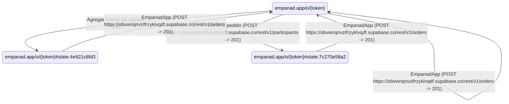

> **Crawl coverage:** 1/8 pages (12%), 25/60 components interacted with (42%), 9 API endpoints discovered.
>
> Scope: the site's public surface. The crawl does not sign in, so any page or flow behind authentication is absent from this document and is not counted as missing below.

# User Flows: www.empanad.app

3 screens, 5 distinct moves between them. States are route shapes, not raw URLs, so many instances of one screen collapse into one node.

Each request is attributed to the interaction that fired it, using the position both carry. A move is marked *not attributable* only where that position is missing - a graph crawled before interactions were stamped - rather than being given a status it may not have had.

## Transitions

| From | Trigger | Action | Endpoint | Status | To |
|---|---|---|---|---|---|
| empanad.app/o/{token} | EmpanadApp | click | POST https://obvwnqnvzifrzyklvqdf.supabase.co/rest/v1/orders?select=* | 201 | empanad.app/o/{token} |
| empanad.app/o/{token} | Agregar pedido de alguien más | click | - | - | empanad.app/o/{token}#state:4e921c8fd3 |
| empanad.app/o/{token} | Unirte al pedido | click | POST https://obvwnqnvzifrzyklvqdf.supabase.co/rest/v1/participants?select=* | 201 | empanad.app/o/{token}#state:7c270e58a2 |
| empanad.app/o/{token}#state:4e921c8fd3 | EmpanadApp | click | POST https://obvwnqnvzifrzyklvqdf.supabase.co/rest/v1/orders?select=* | 201 | empanad.app/o/{token} |
| empanad.app/o/{token}#state:7c270e58a2 | EmpanadApp | click | POST https://obvwnqnvzifrzyklvqdf.supabase.co/rest/v1/orders?select=* | 201 | empanad.app/o/{token} |
