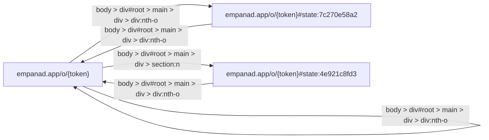

# Empanad App Digital Blueprint

## Overview

Empanad.app is a web application that facilitates group ordering of empanadas. Users can create an order, select custom toppings and quantities, add details for multiple people, and finalize their purchase with payment. The app also includes sharing options to invite friends or family to join the order.

## Navigation Graph

## Application Structure

### Main Page (empanad.app/o/{token})

This is the primary page where users interact with the application. It includes various components that allow them to create and manage their order.

#### Components:

- **Navigation and Links**
  - **EmpanadApp**: A link or logo, likely serving as a brand identifier.

- **Sharing Options**
  - **Copiar Link**: A button for copying a shareable URL.
  - **Invitar por WhatsApp**: A button to send the current page via WhatsApp.

- **Order Creation**
  - **Crear Pedido**: A submit button to finalize the order and proceed to payment.

- **Toppings Selection**
  - **Otra / No sé**: A searchable dropdown for selecting custom or unspecified toppings.

- **Quantity Control**
  - Multiple instances of "Sumar" (Add) and "Restar" (Subtract) buttons, allowing users to adjust the quantity of each item in their order.

- **Detailed Order Options**
  - **Detalle por persona**: A button to add another person's details to the order.
  - **Agregar pedido de alguien más**: Another button for adding a separate order for someone else.

- **Contact Information**
  - A text field for users to input their contact information.

- **Restaurant Selection**
  - **Otra / No sé**: A searchable dropdown option for selecting a restaurant not listed in the initial menu.
  - Multiple options like "Mi Gusto," "La Continental," etc., indicating available restaurants.

- **Variety of Toppings**
  - Multiple searchable dropdowns or lists allowing users to select specific toppings for their order. Over 100 different topping options are available.

- **Additional Controls**
  - Another searchable dropdown with options similar to the toppings list.

### Pending Pages

- **empanad.app**: The main page is pending, indicating it's not yet fully crawled.
  
- **empanad.app/o/{token}#state:4e921c8fd3** and **empanad.app/o/{token}#state:7c270e58a2**: These pages are also marked as pending. They likely represent different states or views of the main page, but they haven't been fully analyzed.

## User Navigation Flow

1. **Launch Application**
   - Users open their web browser and navigate to `empanad.app/o/{token}`.

2. **Initial View**
   - Upon loading, users see the main order page with various components.

3. **Select Toppings**
   - Users can add or modify toppings using the "Otra / No sé" dropdowns.
   - They can adjust the quantity of each item using the "Sumar" and "Restar" buttons.

4. **Add Multiple People**
   - If needed, users can add details for multiple people by clicking the "Detalle por persona" button.
   - Each additional person's details can be entered into the text field and restaurant selection dropdowns.

5. **Select Restaurant**
   - Users choose a restaurant from the available options or select "Otra / No sé" to specify a non-listed restaurant.

6. **Review and Finalize Order**
   - The user reviews their order and clicks the "Crear Pedido" button to finalize the order and proceed to payment.

7. **Share Order Link**
   - Users can share their order link via WhatsApp or copy it for others to join.

## Summary

Empanad.app provides a straightforward interface for group empanada ordering. It allows users to customize their orders, manage multiple people's details, and easily share the order with friends or family. The application ensures real-time updates on the total cost as users add or modify items in their order.