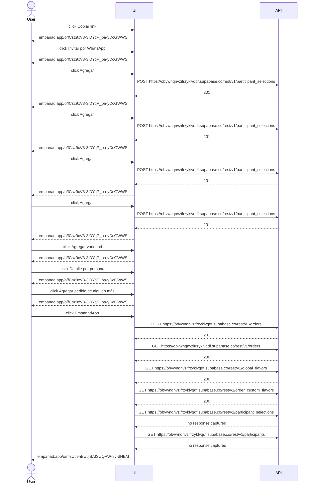
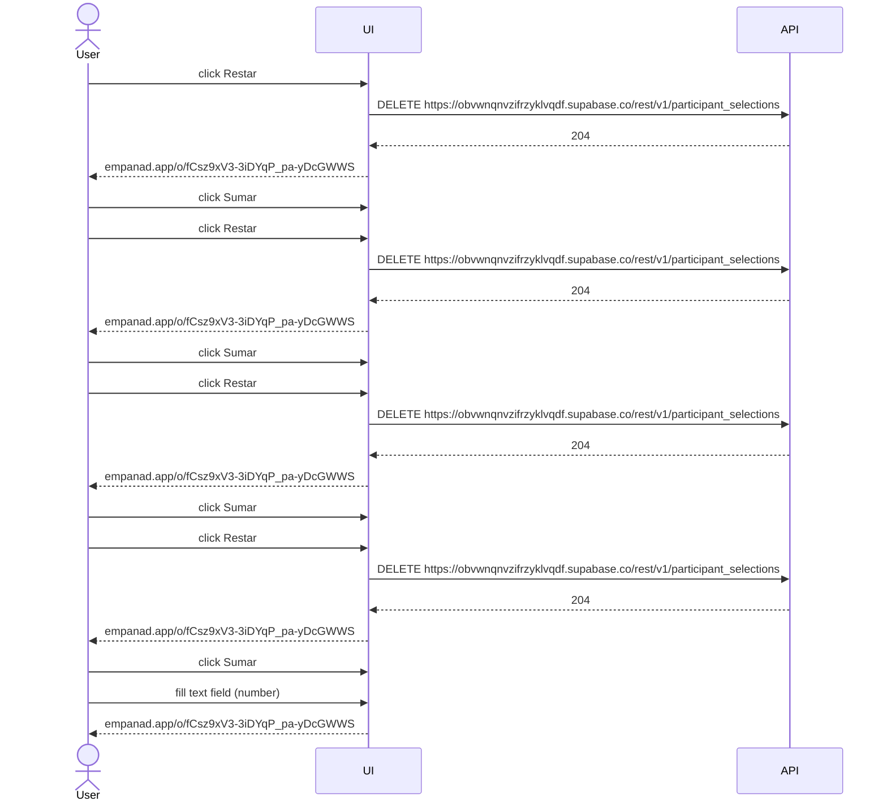
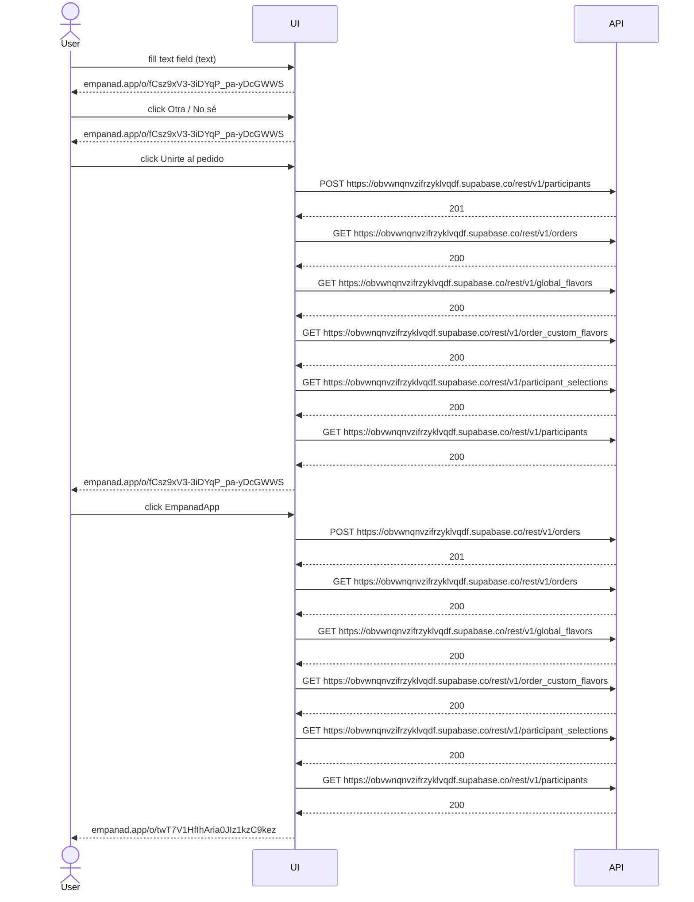
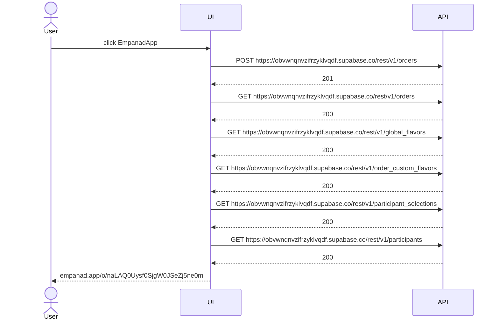

> **Crawl coverage:** 1/8 pages (12%), 25/60 components interacted with (42%), 9 API endpoints discovered.
>
> Scope: the site's public surface. The crawl does not sign in, so any page or flow behind authentication is absent from this document and is not counted as missing below.

# Sequence Diagrams: www.empanad.app

The same traces the behaviour specification renders as scenarios, drawn. Not a second source of truth - a trace already *is* a sequence, so these cannot disagree with it.

## click Copiar link on empanad.app/o/msUc9nBw6jBAfSUQPW-8y-dNEMtdMsD5

## click Restar on empanad.app/o/fCsz9xV3-3iDYqP_pa-yDcGWWSw5xxNx

## fill text field (text) on empanad.app/o/twT7V1HfIhAria0JIz1kzC9kezoVNzU-

## click EmpanadApp on empanad.app/o/naLAQ0Uysf0SjgW0JSeZj5ne0meo96rV

